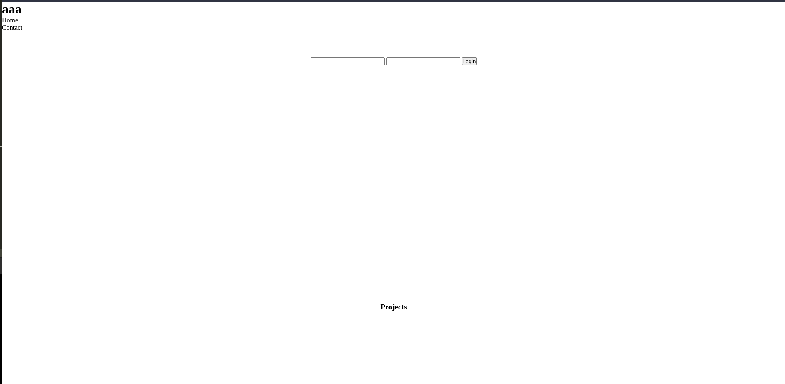
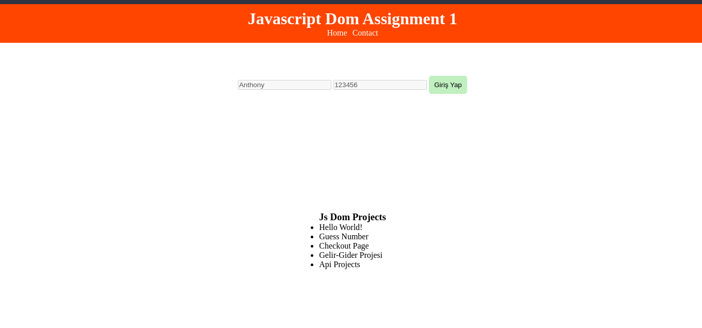

### JavaScript DOM Assignment 1

### Amaç:

- Bu görevin amacı, öğrendiklerinizi pekiştirmek. JS DOM kullanarak verilen html yapısını aşağıdaki adımlarla modifiye etmeniz beklenmektedir. HTML Çıktısının şuanki hali ve JS eklendikten sonraki örnek yapısı aşağıdaki resimlerde verilmiştir.

### Before

### After

### Demo

[Live](https://anthonyins.github.io/js-dom-ass1/)

### Adımlar:

1. `header` classına sahip olan elementi `querySelector()` metodu ile yakalayınız. Background color, color, padding özellikleri ekleyiniz ve text hizalamasını `center` olarak ayarlayınız.

2. `title` id sine sahip olan elementi `getElementById()` metodunu kullanarak yakalayınız. Ve **"Javascript Dom Assignment 1"** metnini `textContent` özelliği ile ekleyiniz. 
 
3. `nav-item` classına sahip olan elementi `querySelector()` metodu ile yakalayınız. Flexbox(center olsun) özelliği ekleyiniz ve elementler arasına gap özelliği ile boşluk ekleyiniz. List style özelliğini kaldırınız.

4. `username` ve `password` idsine sahip olan inputları `querySelector()` metodu ile yakalayınız. İnputların value attributelarını kullanarak Username inputuna **"Anthony"** yazınız, password inputuna **"123456"** yazınız. Ayrıca password inputuna yazılan değerin görülmesini sağlayın. Ve inputların disabled özelliğini aktif ediniz. (**Not:** html de input `type=password`  olduğunda bildiğiniz üzere yazılan değerler saklanıyor. Bu özelliği js ile değiştirmeniz lazım.)

5. `btn` classına sahip olan elementi `querySelector()` metodu ile yakalayınız. Background color, color, padding, border-radius özellikleri ekleyiniz. Cursor pointer olsun ve border özelliği none olsun. Ayrıca button elementinin metni **"Giriş Yap"** metni olsun.

6. `projects` idsine sahip olan elementi `getElementById()` metodunu kullanarak yakalayınız. Yakaladığınız bu element üzerinden bu elementin first childi olan h3 elementine ulaşıp metnini **"Js Dom Projects"** olarak değiştiriniz.

7. `const myProjects = ["Hello World!","Guess Number","Checkout Page","Gelir-Gider Projesi","Api Projects"];`
Verilen myProjects arrayindeki elemanları bir önceki adımda yakaladığınız `projects` idsine sahip olan elementin last childi olan ul elementine `innerHTML` özelliğini kullanarak tek tek li elementleri içerisinde child olarak ekleyiniz.

**Not :** 
- Tüm bu işlemleri Javascript Dom kullanarak yapınız.
- Kendinize göre eklemeler yapabilirsiniz.

